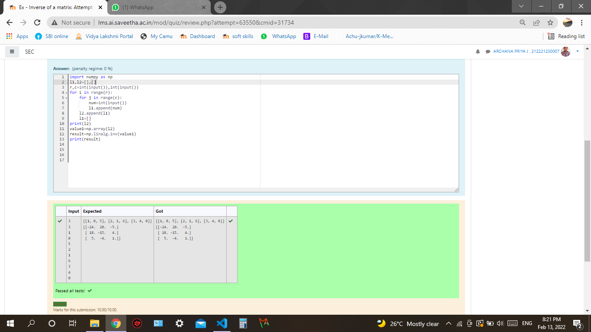

# Inverse-of-matrix

## AIM:
To find the inverse of a given matrix using numpy.

## ALGORITHM:
### Step 1:
Import numpy.
### Step 2:
Get input and append it in an empty array.
### Step 3:
Use inv() function to find inverse.
### Step 4:
store the result in a variable.
### Step 5:
Print the result.

## PROGRAM:
```
Name:J.Archana priya
Reg no:21500533

import numpy as np
l1,l2=[],[]
r,c=int(input()),int(input())
for i in range(r):
    for j in range(c):
        num=int(input())
        l1.append(num)
    l2.append(l1)
    l1=[]
print(l2)
value1=np.array(l2)
result=np.linalg.inv(value1)
print(result)

```

## OUTPUT:

## RESULT:
